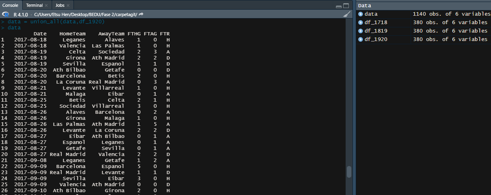

## Equipo 12  
-Márquez Estrada Arath Patricio  
-Rivera Vargas Juan  
-Briceño Díaz Sofía  
-Benitez Garcia Saul Enrique  
-Enríquez López José Andrés  
-Juárez Fonseca César Eduardo

# Introducción 
La presión social juega un papel importante en el comportamiento de las personas y de grupos sociales. Esto se ha observado en diferentes estudios en economía, sociología y sicología. Algunos ejemplos actuales se pueden observar en inversiones (miedo a quedarse fue en inversiones como son acciones de empresas, criptomonedas o fondos de inversión), participación electoral (mayor porcentaje de votantes en elecciones intermedias en México), demandas sociales (manifestaciones, huelgas, concentraciones), decisiones gubernamentales (aceptación o rechazo de políticas internas o externas), etc.

El deporte es un evento social que puede concentrar a uno o más grupos sociales, que pueden participar de forma pasiva (espectadores) o activa (jugadores). Uno de los deportes más populares a nivel mundial es el futbol soccer, existiendo incluso una institución que gobierna a todas las federaciones a nivel mundial, llamada Federación Internacional de Fútbol Asociación (FIFA). De este modo, el fútbol soccer concentra mueve grandes masas y flujos de efectivo. 

Desde hace varios años el fútbol atrae a un sin número de personas a nivel mundial a los estadios para apoyar a su equipo favorito. Esto provoca en los jugadores de fútbol una presión social por ganar el partido, sin embargo, en diferentes estudios se ha observado que existe una tendencia de ventaja al jugar como equipo local. Esta ventaja se presenta al mostrar un mayor apoyo al equipo local dado por los expectarodes y el personal de arbitraje.

# Hipótesis
En el presente, se observará la relación de las anotaciones de los equipos al jugar como equipo local y visitante en la liga española de soccer de 2017-2020. Como hipótesis, se plantea que existe una dependencia en las anotaciones de los equipos al jugar como equipo local (obteniendo una mayor probabilidad de anotar) o jugar como equipo visitante (obteniendo una mayor probabilidad de anotación).   

# POSTWORK 1.

# Objetivo

 - Obtener Frecuencias y sus probabilidades Marginales

# Desarrollo

 1. Carga de los paquetes o bibliotecas que se emplearan a lo largo de los postworks

```R
library(ggplot2)
library(RColorBrewer)
library(dplyr)
library(boot)
library(plotly)
```

 2. Establecimiento del espacio de trabajo en el directorio del archivo fuente con:

```R
setwd(dirname(rstudioapi::getActiveDocumentContext()$path))
```

 3. Carga de datos

 ```R
df_1920 <- read.csv("https://www.football-data.co.uk/mmz4281/1920/SP1.csv")
```

 4. Extracción de las columnas que contienen:
    - Número de goles anotados por los equipos que jugaron en casa (FTHG, columna 6) 
    - Número de goles anotados por los equipos que jugaron como visitante (FTAG, columna 7)
 ```R
df_1920 <- df_1920[,c(6,7)]
```

  5. Consulta de la función table

```R
?table
```
 
 6. Cálculo de las probabilidades marginales

```R
(FTHG_pm = table(df_1920$FTHG)/dim(df_1920)[1]) # pm de goles en casa
(FTAG_pm = table(df_1920$FTAG)/dim(df_1920)[1]) # pm de goles como visitante
```

 7. Cálculo de la probabilidad conjunta

```R
(FTHG_FTAG_pc <- table(df_1920$FTHG, df_1920$FTAG)/dim(df_1920)[1]) 
```


# POSTWORK 2

# Objetivo 
- Importar múltiples archivos csv a `R`
- Observar algunas características y manipular los data frames
- Combinar múltiples data frames en un único data frame

# Desarrollo

 1. Carga de datos de soccer temporadas 2017/2018, 2018/2019 y 2019/2020 de la primera división liga española
```R
df_1718 = read.csv("https://www.football-data.co.uk/mmz4281/1718/SP1.csv")
df_1819 = read.csv("https://www.football-data.co.uk/mmz4281/1819/SP1.csv")
df_1920 = read.csv("https://www.football-data.co.uk/mmz4281/1920/SP1.csv")
```

 2. Revisión de información de los dataframe con las funciones

```R
str(df_1718)
...
head(df_1718)
...
View(df_1718)
...
summary(df_1718)
...
```

 3. Selección de las columnas Date, HomeTeam, AwayTeam, FTHG, FTAG y FTR
```R
df_1718 = select(df_1718,Date:FTR)
df_1819 = select(df_1819,Date:FTR)
df_1920 = select(df_1920,Date:FTR)
df_1920 = df_1920[,-2] # Elimina columna "Time" de los datos de la temporad 2019/2020
```
 4. Reparación de fechas en los dataframes
```R
df_1718 = mutate(df_1718,Date = as.Date(Date,"%d/%m/%y"))
df_1819 = mutate(df_1819,Date = as.Date(Date,"%d/%m/%Y"))
df_1920 = mutate(df_1920,Date = as.Date(Date,"%d/%m/%Y"))
```

 5. Union de los dataframe en un único dataframe
```R
data = union_all(df_1718,df_1819)
data = union_all(data,df_1920)
```
<p align="center">

</p>

# POSTWORK 3

# Objetivo 
- Conocer mejor el conjunto de datos con el que se esté trabajando, 
- Llevar a cabo visualizaciones
- Plantear hipótesis 
- Formular preguntas relevantes.  

# Desarrollo

 1. Cálculo de probabilidades marginales para equipo local
 ```R
(FTHG.tab <- table(data$FTHG)/dim(data)[1])
```

 2. Cálculo de probabilidades marginales para equipo visitante
```R
(FTAG.tab <- table(data$FTAG)/dim(data)[1] )
```

 3. Cálculo de probabilidad conjunta para equipo local y visitante
```R
(conjunto.tab <- table(data$FTHG, data$FTAG)/dim(data)[1])
```
 4. Gráfico de barras para las probabilidades marginales estimadas del número de goles que anota el equipo de casa.
  
```R
barplot(FTHG.tab,main = "Equipo de casa (FTHG)",
        col = c(brewer.pal(8, "Dark2")),
        xlab = "Número de goles",
        ylab = "Frecuencia")
```
<p align="center">

</p>

 5. Gráfico de barras para las probabilidades marginales estimadas del número de goles que anota el equipo visitante.
```R
barplot(FTAG.tab,main = "Equipo visitante (FTAG)",
        col = c(brewer.pal(5, "Set1")),
        xlab = "Número de goles",
        ylab = "Frecuencia")
```

<p align="center">

</p>
 
 6. Mapa de calor para las probabilidades conjuntas estimadas de los números de goles que anotan el equipo de casa y el equipo visitante en un partido.

```R
conjunto.df <- as.data.frame(conjunto.tab)
colnames(conjunto.df) <- c("FTHG","FTAG","Frecuencia")

ggplot(conjunto.df,aes(x=FTHG,y=FTAG, fill=Frecuencia)) +
  geom_tile() + scale_fill_distiller(palette="GnBu",trans = 'reverse',direction=-1)+
  geom_text(aes(label=round(Frecuencia,3)), size=3)
```

<p align="center">

</p>

## Observaciones
Con base en el mapa de calor que resume la probabilidades conjuntas de anotaciones por equipos de casa y visitante, se observa que existe una mayor probabilidad de anotación del equipo que juega como local en comparación con el que juega como visitante. Esto indica que, el jugador local tendra una mayor probabilidad de ganar el partido.

# POSTWORK 4

# Objetivo

- Investigar la dependencia o independecia de las variables aleatorias X y Y, el número de goles anotados por el equipo de casa y el número de goles anotados por el equipo visitante.

# Desarrollo

1. Obten tabla de cocientes de probabilidad conjunta entre el producto de las probabilidades marginales 
```R
 FTHG.df <- as.data.frame(FTHG.tab)
 FTAG.df <- as.data.frame(FTAG.tab)

 conjunto.df <- cbind(conjunto.df, rep(FTHG.df$Freq,nrow(FTAG.df)),rep(FTAG.df$Freq, each=nrow(FTHG.df)))
 colnames(conjunto.df) <- c("FTHG","FTAG", "ProbAcum", "ProbH","ProbA")
 conjunto.df <- mutate(as.data.frame(conjunto.df), Cocientes=ProbAcum/(ProbH*ProbA))


```
2. Gráfico de barras para el cociente de las probabilidades conjuntas entre el producto de las probabilidades marginales
```R
 hist(conjunto.df$Cocientes, breaks = seq(0,5,0.5), #braques donde se va partieno
     main = "Tabla de Cocientes",
     xlab = "Cociente",
     ylab = "Frecuencia",
     col = c(brewer.pal(5, "YlOrRd")))
median(conjunto.df$Cocientes)
```
<p align="center">

</p>

3. Aplicación del método de Bootstrap para la obtención de la aproximación de distribución de las muestras
```R
bootstrap <- replicate(n=10000, sample(conjunto.df$Cocientes, replace = TRUE))
bootstrap <- colMeans(bootstrap)
gdf4<-ggplot() + 
  geom_histogram(aes(bootstrap), bins = 50, fill=rainbow(50)) + 
  geom_vline(aes(xintercept = mean(bootstrap)), color="deepskyblue3") +
  ggtitle('Histograma de la distribución \n de las medias muestrales.')
ggplotly(gdf4)
```

<p align="center">

</p>

4. Determinación de ndependencia de las variabeles X e Y
    Para determinar la independencia de las variables X (goles obtenidos por el equipo local) e Y (goles obtenidos por el equipo visitante) se hace uso de prueba t-student, que considera lo siguiente:
     - Hipótesis nula H0: μ = 1, indica la independencia de las anotaciones obtenidas por los equipos al jugar como equipo local o visitante.
     - Hipótesis alternativa H1: μ!=0, indica la dependencia de las anotaciones obtenidas por los equipos al jugar como equipo local o visitante.
     - Hipótesis de dos colas.
     - Nivel de significancia estadística de α=0.95 

```R
 t.test(bootstrap, alternative = "two.sided", mu = 1, conf.level = 0.95)
 
 data:  bootstrap
 t = -115.39, df = 9999, p-value < 2.2e-16
 alternative hypothesis: true mean is not equal to 1
 95 percent confidence interval:
  0.8571245 0.8618975
 sample estimates:
 mean of x 
  0.859511 
```

# CONCLUSIÓN

 Con base en el resultado de la prueba t-student con una hipótesis de dos colas se obtiene un p-value < α:
```R 
  p-value < 2.2e-16 < 0.05 = α
```
indicando que la hipótesis nula se rechaza y la media de la distribución es diferente de 1. Por lo tanto, las variables X e Y son variables dependientes, i.e., los goles obtenidos en cada partido se ven influenciados al jugar como equipo local o visitante.


# Postwork 5  

## Objetivo
- Continuar con el desarrollo de los postworks; en esta ocasión se utiliza la función predict para realizar predicciones de los resultados de partidos para una fecha determinada  

## Desarrollo
### Punto 1
- Crea el data frame SmallData, que contenga las columnas date, home.team, home.score, away.team y away.score de las temporadas de las temporadas 2017/2018, 2018/2019 y 2019/2020.

```R  
#Carga de Paquetes
library(dplyr)
library(fbRanks)

#Carga de los archivos Csv  
df_1718 = read.csv("https://www.football-data.co.uk/mmz4281/1718/SP1.csv")
df_1819 = read.csv("https://www.football-data.co.uk/mmz4281/1819/SP1.csv")
df_1920 = read.csv("https://www.football-data.co.uk/mmz4281/1920/SP1.csv")

#Selección de las columnas Date, HomeTeam, AwayTeam, FTHG, FTAG
df_1718 = select(df_1718,Date:FTAG)
df_1819 = select(df_1819,Date:FTAG)
df_1920 = select(df_1920,Date:FTAG)
df_1920 = df_1920[,-2] # Elimina columna "Time" de los datos de la temporada 2019/2020

#Formateo de Fechas
df_1718 = mutate(df_1718,Date = as.Date(Date,"%d/%m/%y"))
df_1819 = mutate(df_1819,Date = as.Date(Date,"%d/%m/%Y"))
df_1920 = mutate(df_1920,Date = as.Date(Date,"%d/%m/%Y"))

#-----------Unión de data frames----------
SmallData <- rbind(df_1718,df_1819,df_1920)
colnames(SmallData) = c('date','home.team','away.team','home.score','away.score')
SmallData = SmallData[,c(1,2,4,3,5)]

```

- Establece un directorio de trabajo y con ayuda de la función write.csv guarda el data frame como un archivo csv con nombre soccer.csv.

```R  
#----------Guardar CVS en el directorio--------
setwd("/home/arath/Documents/CURSOS/DataScience/")
write.csv(SmallData, "soccer.csv", row.names = FALSE)
```
### Punto 2  

- Con la función create.fbRanks.dataframes del paquete fbRanks importe el archivo soccer.csv a R y al mismo tiempo asignelo a una variable llamada listasoccer.  

```R  
listasoccer <- create.fbRanks.dataframes(scores.file="soccer.csv")
```
-  Se creará una lista con los elementos scores y teams que son data frames listos para la función rank.teams. Asigna estos data frames a variables llamadas anotaciones y equipos.  

```R  
anotaciones <-listasoccer$scores
equipos <- listasoccer$teams
```

### Punto 3

- Crea un vector de fechas (fecha) que no se repitan y que correspondan a las fechas en las que se jugaron partidos. Crea una variable llamada n que contenga el número de fechas diferentes.
```R  
#------Vector de fechas (fecha) que no se repitan y variable n con el número de fechas diferentes
fecha <- sort(unique(anotaciones$date))
n <- length(fecha)
```
-  Crea un ranking de equipos usando únicamente datos desde la fecha inicial y hasta la penúltima fecha en la que se jugaron partidos

```R  
#----------Ranking de equipos de la primera a la penúltima fecha----------
ranking <- rank.teams(scores=anotaciones, teams=equipos,
                      min.date = fecha[1], max.date=fecha[n-1],
                      date.format = '%d/%m/%Y')
```
```R 
> ranking

Team Rankings based on matches 18/08/2017 to 16/07/2020
   team        total attack defense n.games.Var1 n.games.Freq
1  Barcelona    1.51 2.23   1.28    Barcelona    113         
2  Ath Madrid   1.24 1.33   1.78    Ath Madrid   113         
3  Real Madrid  1.15 1.86   1.19    Real Madrid  113         
4  Valencia     0.56 1.34   1.10    Valencia     113         
5  Getafe       0.55 1.10   1.33    Getafe       113         
6  Sevilla      0.43 1.37   0.98    Sevilla      113         
7  Granada      0.37 1.26   1.03    Granada       37         
8  Villarreal   0.33 1.38   0.91    Villarreal   113         
9  Sociedad     0.32 1.39   0.90    Sociedad     113         
10 Ath Bilbao   0.15 1.02   1.09    Ath Bilbao   113         
11 Osasuna      0.07 1.18   0.89    Osasuna       37         
12 Betis        0.05 1.28   0.81    Betis        113         
13 Celta        0.02 1.26   0.81    Celta        113         
14 Eibar       -0.02 1.08   0.91    Eibar        113         
15 Levante     -0.03 1.26   0.78    Levante      113         
16 Girona      -0.18 1.07   0.83    Girona        76         
17 Espanol     -0.21 0.93   0.93    Espanol      113         
18 Alaves      -0.23 0.95   0.90    Alaves       113         
19 Leganes     -0.31 0.82   0.98    Leganes      113         
20 Valladolid  -0.33 0.79   1.00    Valladolid    75         
21 Huesca      -0.35 1.09   0.72    Huesca        38         
22 Mallorca    -0.41 1.02   0.74    Mallorca      37         
23 Vallecano   -0.51 1.04   0.67    Vallecano     38         
24 La Coruna   -0.82 0.94   0.60    La Coruna     38         
25 Malaga      -1.17 0.58   0.76    Malaga        38         
26 Las Palmas  -1.43 0.59   0.63    Las Palmas    38   
```

### Punto 4

- Estima las probabilidades de los eventos, el equipo de casa gana, el equipo visitante gana o el resultado es un empate para los partidos que se jugaron en la última fecha del vector de fechas fecha.

```R  
#----Función predict: El equipo de casa gana, el equipo visitante gana o probabilidad de empate
predict(ranking, date = fecha[n])
```
```R 
Predicted Match Results for 01/05/1900 to 01/06/2100
Model based on data from 18/08/2017 to 16/07/2020
---------------------------------------------
19/07/2020 Alaves vs Barcelona, HW 9%, AW 76%, T 15%, pred score 0.7-2.5  actual: AW (0-5)
19/07/2020 Valladolid vs Betis, HW 29%, AW 43%, T 28%, pred score 1-1.3  actual: HW (2-0)
19/07/2020 Villarreal vs Eibar, HW 45%, AW 30%, T 25%, pred score 1.5-1.2  actual: HW (4-0)
19/07/2020 Ath Madrid vs Sociedad, HW 54%, AW 20%, T 26%, pred score 1.5-0.8  actual: T (1-1)
19/07/2020 Espanol vs Celta, HW 32%, AW 41%, T 27%, pred score 1.2-1.4  actual: T (0-0)
19/07/2020 Granada vs Ath Bilbao, HW 40%, AW 31%, T 29%, pred score 1.2-1  actual: HW (4-0)
19/07/2020 Leganes vs Real Madrid, HW 13%, AW 66%, T 21%, pred score 0.7-1.9  actual: T (2-2)
19/07/2020 Levante vs Getafe, HW 25%, AW 48%, T 27%, pred score 0.9-1.4  actual: HW (1-0)
19/07/2020 Osasuna vs Mallorca, HW 48%, AW 28%, T 25%, pred score 1.6-1.1  actual: T (2-2)
19/07/2020 Sevilla vs Valencia, HW 34%, AW 40%, T 26%, pred score 1.2-1.4  actual: HW (1-0)
```

