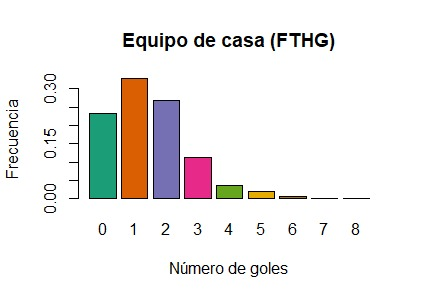
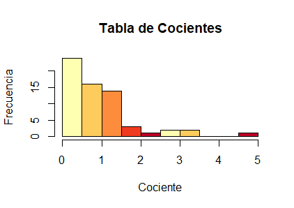
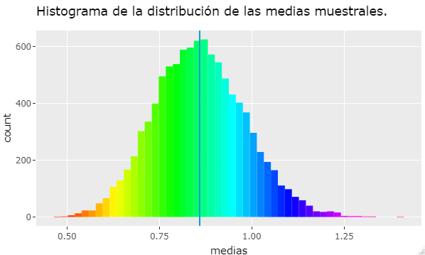

# POSTWORK 1 Sesión 1.

# Objetivo

 -Sacar Frecuencias y sus probabilidades Marginales

# Desarrollo

 1. Aplicamos las librerias que vamos a ocupar en estos postworks

```R
library(ggplot2)
library(RColorBrewer)
library(dplyr)
library(boot)
```

 2. Ajustamos nuestro espacio de trabajo con

```R
setwd(dirname(rstudioapi::getActiveDocumentContext()$path))
```

 3. Cargamos los datos

 ```R
df_1920 <- read.csv("https://www.football-data.co.uk/mmz4281/1920/SP1.csv")
```

 4. Extraemos las columnas que contienen:
    - Número de goles anotados por los equipos que jugaron en casa (FTHG, columna 6) 
    - Número de goles anotados por los equipos que jugaron como visitante (FTAG, columna 7)
 ```R
df_1920 <- df_1920[,c(6,7)]
```

  5. Consultamos la función table

```R
?table
```
 
 6. Calculamos probabilidades marginales

```R
(FTHG_pm = table(df_1920$FTHG)/dim(df_1920)[1]) # pm de goles en casa
(FTAG_pm = table(df_1920$FTAG)/dim(df_1920)[1]) # pm de goles como visitante
```

 7. Calculamos probabilidades conjuntas

```R
(FTHG_FTAG_pc <- table(df_1920$FTHG, df_1920$FTAG)/dim(df_1920)[1]) 
```


# POSTWORK 2

# Objetivo 
- Importar múltiples archivos csv a `R`
- Observar algunas características y manipular los data frames
- Combinar múltiples data frames en un único data frame

# Desarrollo

 1. Carga de datos de soccer temporadas 2017/2018, 2018/2019 y 2019/2020 de la primera división liga española
```R
df_1718 = read.csv("https://www.football-data.co.uk/mmz4281/1718/SP1.csv")
df_1819 = read.csv("https://www.football-data.co.uk/mmz4281/1819/SP1.csv")
df_1920 = read.csv("https://www.football-data.co.uk/mmz4281/1920/SP1.csv")
```

 2. Revisión de información de los dataframe con las funciones

```R
str(df_1718)
...
head(df_1718)
...
View(df_1718)
...
summary(df_1718)
...
```

 3. Selección de las columnas Date, HomeTeam, AwayTeam, FTHG, FTAG y FTR
```R
df_1718 = select(df_1718,Date:FTR)
df_1819 = select(df_1819,Date:FTR)
df_1920 = select(df_1920,Date:FTR)
df_1920 = df_1920[,-2] # Elimina columna "Time" de los datos de la temporad 2019/2020
```
 4. Reparación de fechas en los dataframes
```R
df_1718 = mutate(df_1718,Date = as.Date(Date,"%d/%m/%y"))
df_1819 = mutate(df_1819,Date = as.Date(Date,"%d/%m/%Y"))
df_1920 = mutate(df_1920,Date = as.Date(Date,"%d/%m/%Y"))
```

 5. Union de los dataframe en un único dataframe
```R
data = union_all(df_1718,df_1819)
data = union_all(data,df_1920)
```


# POSTWORK 3

# Objetivo 
- Conocer mejor el conjunto de datos con el que se esté trabajando, 
- Llevar a cabo visualizaciones
- Plantear hipótesis 
- Formular preguntas relevantes.  

# Desarrollo

 1. Cálculo de probabilidades marginale para equipo local
 ```R
(FTHG.tab <- table(data$FTHG)/dim(data)[1])
```

 2. Cálculo de probabilidades marginale para equipo visitante
```R
(FTAG.tab <- table(data$FTAG)/dim(data)[1] )
```

 3. Cálculo de probabilidad conjunta para equipo local y visitante
```R
(conjunto.tab <- table(data$FTHG, data$FTAG)/dim(data)[1])
```
 4. Un gráfico de barras para las probabilidades marginales estimadas del número de goles que anota el equipo de casa.
```R
barplot(FTHG.tab,main = "Equipo de casa", col = c("blue","yellow","orange","green"))
```



 5. Un gráfico de barras para las probabilidades marginales estimadas del número de goles que anota el equipo visitante.
```R
barplot(FTAG.tab,main = "Equipo visitante", col = c("purple","orange","blue","pink"))
```


 6. Un HeatMap para las probabilidades conjuntas estimadas de los números de goles que anotan el equipo de casa y el equipo visitante en un partido.

```R
conjunto.df <- as.data.frame(conjunto.tab)
colnames(conjunto.df) <- c("FTHG","FTAG","Frecuencia")

ggplot(conjunto.df,aes(x=FTHG,y=FTAG, fill=Frecuencia)) +
  geom_tile() + scale_fill_distiller(palette="GnBu",trans = 'reverse',direction=-1)+
  geom_text(aes(label=round(Frecuencia,3)), size=3)
```


# POSTWORK 4

# Objetivo

- Investigar la dependencia o independecia de las variables aleatorias X y Y, el número de goles anotados por el equipo de casa y el número de goles anotados por el equipo visitante.

# Desarrollo
 1. Obten tabla de cocientes pc/pm

```R
conjunto.df <- cbind.data.frame(conjunto.tab, matrix(0,dim(conjunto.df)[1], dim(conjunto.df)[2] ) )
colnames(conjunto.df) <- c("FTHG","FTAG","ProbAcum", "ProbH", "ProbA", "Cocientes")
```

 2. Obten tabla de cocientes Pcoc = pc/pm
```R
Pcoc = matrix(0, dim(conjunto.tab)[1],dim(conjunto.tab)[2])
for (j in 1:dim(conjunto.tab)[2]) {
  for (i in 1:dim(conjunto.tab)[1]) {
    
    Pcoc[i,j] <- conjunto.tab[i,j]/as.vector(FTHG.tab[i]*FTAG.tab[j])
    # print(i+(9*(j-1)))
    conjunto.df[(i+(9*(j-1))),4] = FTHG.tab[i]
    conjunto.df[(i+(9*(j-1))),5] = FTAG.tab[j]
    conjunto.df[(i+(9*(j-1))),6] = Pcoc[i,j]
    
  }
}

hist(conjunto.df$Cocientes, breaks = seq(0,5,0.5), #braques donde se va partieno
     main = "Tabla de Cocientes",
     xlab = "Cociente",
     ylab = "Frecuencia")
median(conjunto.df$Cocientes)
```


 3. Graficar un histograma

```R
medias <- c()
for(i in 1:10000){
  set.seed(2*i)
  medias[i] = mean(sample(conjunto.df$Cocientes, length(conjunto.df$Cocientes), replace = TRUE))
  
}
gdf4<-ggplot() + 
  geom_histogram(aes(medias), bins = 50, fill=rainbow(50)) + 
  geom_vline(aes(xintercept = mean(medias)), color="deepskyblue3") +
  ggtitle('Histograma de la distribución de las medias muestrales.')
ggplotly(gdf4)
```


